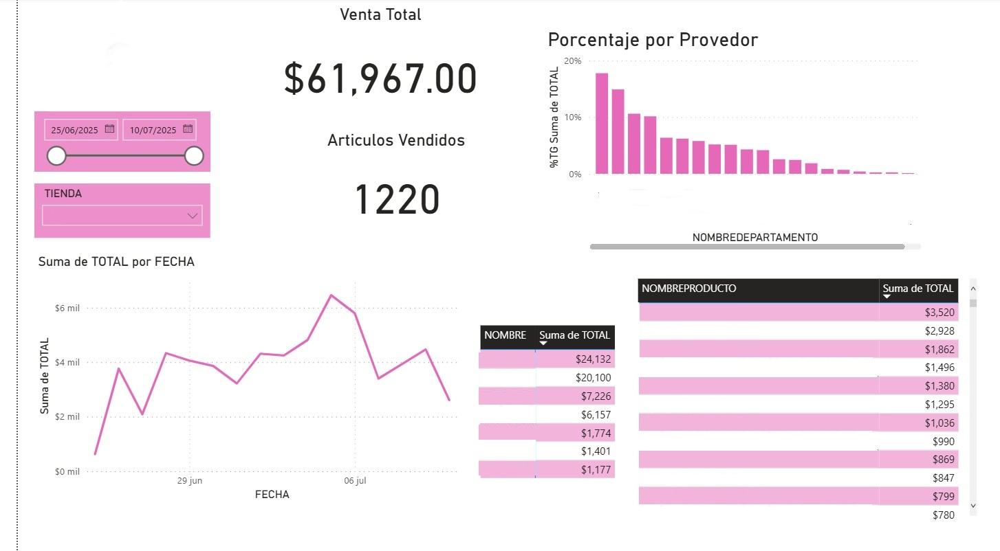

# ETL, Unificación y visualización de Datos de Ventas - Proyecto Eleventa
---
Este repositorio contiene el proceso ETL (Extract, Transform, Load) para extraer información desde una base de datos **Firebird (.FDB)** de Eleventa, transformarla con Python y consolidarla en un archivo final para análisis y visualización.

*Estructura del proyecto*
proyect/
│
├── README.md
├── extract.py
├── VENTASCOMPLETO.csv
├── DashboardTrends.pbix
│
├── Tienda1/
│   ├── DEPARTAMENTOS.csv
│   ├── PDVDATA.fdb
│   ├── PRODUCTOS.csv
│   ├── VENTASTICKETS_ARTICULOS.csv
│   └── VENTASTICKETS.csv
│
├── Tienda2/
│   ├── DEPARTAMENTOS.csv
│   ├── PDVDATA.fdb
│   ├── PRODUCTOS.csv
│   ├── VENTASTICKETS_ARTICULOS.csv
│   └── VENTASTICKETS.csv
│
├── ...
│
└── TiendaN/
    ├── DEPARTAMENTOS.csv
    ├── PDVDATA.fdb
    ├── PRODUCTOS.csv
    ├── VENTASTICKETS_ARTICULOS.csv
    └── VENTASTICKETS.csv

---

*Cómo funciona*

1. *Extracción*  
   El script se conecta a la base **PDVDATA.FDB** usando fdb y extrae las tablas principales:  
   - VENTATICKETS
   - VENTATICKETS_ARTICULOS
   - PRODUCTOS
   - DEPARTAMENTOS

   Cada tabla se exporta como archivo CSV en una carpeta por tienda.

2. *Transformación* 
   Se limpia cada CSV:  
   - Normaliza tipos de datos.  
   - Crea nuevas columnas (TIENDA, FECHA, HORA).  
   - Renombra campos para consistencia.

3. *Merge final*  
   Se combinan los datos de todas las tiendas en un único archivo VENTAS_COMPLETO.csv listo para análisis en Power BI

4. *Implementación de PowerBI*
    Dejo adjunto el archivo de PowerBI para vualizar información

---

**Datos de ejemplo**

En la carpeta /data/Tienda-nesima/ encontrarás archivos de muestra con datos ficticios para probar el flujo sin necesidad de la base real.  
Estos datos fueron generados de forma aleatoria para mantener confidencialidad.

---

**Requisitos**

- Python 3.8+
- Librerías: fdb, pandas
- FireBird (en mi caso 2.5.9)

Instala dependencias:

pip install fdb pandas

A continuacion dejo una foto del tablero de PowerBI y como se muestra la información:

